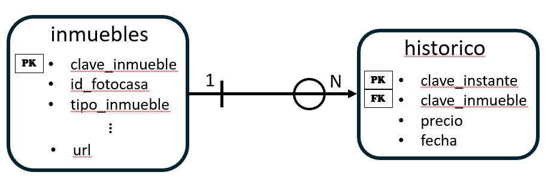

# **real_estate**

**real_estate** es un paquete de *Python* ideado para obtener datos de inmuebles de la página web *fotocasa.es*. Este paquete ofrece la posibilidad de monitorizar periódicamente el precio de múltiples propiedades de pueblos y ciudades de la provincia de Tarragona, así como otros datos relevantes de dichos inmuebles. A continuación se ofrece un listado de las ciudades cuyas viviendas de *fotocasa.es* se pueden *scrapear* con este paquete.

 - Alforja
 - Almoster
 - Altafulla
 - Calafell
 - Cambrils
 - Castellvell del Camp
 - Constantí
 - Creixell
 - El Catllar
 - El Morell
 - El Vendrell
 - La Pobla de Mafumet
 - La Pobla de Montornès
 - La Selva del Camp
 - Les Borges del Camp
 - Maspujols
 - Mont-Roig del Camp
 - Montbrió del Camp
 - Pratdip
 - Riudecanyes
 - Riudecols
 - Riudoms
 - Roda de Berà
 - Salou
 - Tarragona
 - Torredembarra
 - Vandellòs
 - L'Hospitalet de l'Infant
 - Vila-seca
 - Vinyols i els Arcs

El *crawler* realiza solicitudes directamente al *backend* de la página *web*, cuya API se obtuvo de forma legal a través de un proceso de ingeniería inversa del portal inmobiliario. Los datos obtenidos se almacenan en una base de datos de *PostgreSQL*, cuyas sentencias de creación también se incluyen en el paquete. 

Actualmente, en el repositorio únicamente se incluyen los *scripts* referentes a la parte de extracción y almacenamiento de datos. El rastreador se ejecuta cada domingo una vez por semana, por lo que la parte de procesamiento y modelización aún queda pendiente de desarrollar, a espera de disponer de un volumen suficiente de datos con el que poder entrenar modelos de aprendizaje automático robustos. 

El objetivo final del proyecto consiste en entrenar modelos de *machine learning* capaces de detectar oportunidades de mercado en base a la localización física de los inmuebles, así como sus características principales. Para ello, actualmente se recopilan los siguientes datos de cada vivienda.

 - **precio** -> Precio en cada instante (una vez a la semana, también se incluye la fecha en la que se obtuvo cada precio)
 - **id_fotocasa** -> Código identificador de cada inmueble que emplea el portal inmobiliario internamente
 - **tipo_inmueble** -> Categoría a la que pertenece la vivienda. Por ejemplo, casa adosada, chalet, piso...
 - **descripcion** -> Descripción breve del inmueble que proporciona el vendedor
 - **inmobiliaria** -> Agencia que pone a la venta la vivienda
 - **superficie** -> Área que cubre el inmueble en metros cuadrados
 - **habitaciones** -> Número de habitaciones del habitáculo
 - **baños** -> Número de lavabos de la propiedad
 - **extra** -> Características adicionales relevantes del inmueble. Por ejemplo, si tiene calefacción, jardín, aire acondicionado, balcón...
 - **ciudad** -> Población en la que se encuentra la vivienda
 - **zona_de_la_ciudad** -> Barrio en el que se halla la propiedad
 - **calle** -> Calle del inmueble
 - **código_postal** -> Código postal de la zona de la vivienda
 - **latitud** -> Coordenadas latitudinales de la vivienda
 - **longitud** -> Coordenadas longitudinales del inmueble
 - **url** -> Enlace a la publicación de la propiedad en el portal inmobiliario
<br><br>


### Dependencias

El paquete ha sido desarrollado en un entorno virtual usando la siguiente versión de *Python*, junto con las siguientes versiones de las principales librerías que se emplean en el proyecto. De todas formas, todas las dependencias se instalan automáticamente al instalar el paquete en un entorno local como se detalla en el siguiente apartado.

 - python == 3.13.5
 - matplotlib == 3.10.8
 - numpy == 2.4.3
 - pandas == 3.0.1
 - psycopg2 == 2.9.11
 - requests == 2.33.0
 - seaborn == 0.13.2
<br><br>


### Instalación

Para instalar correctamente el paquete **real_estate**, será necesario abrir una terminal de comandos y navegar hasta la dirección donde se haya guardado la carpeta del proyecto.  

```bash
cd path_to_estate/real_estate
```

A continuación, es necesario crear y activar un entorno virtual para poder instalar todas las dependencias del paquete.

```bash
python -m venv real_estate_venv
venv\Scripts\activate
```

Una vez en el directorio del paquete, ejecute el archivo de instalación.

```bash
pip install .
```

Este archivo instalará todas las librerías necesarias para hacer uso del paquete. Para comprobar que se ha instalado correctamente el paquete, ejecute la siguiente instrucción.

```bash
pip show real_estate
```

Si la instalación ha finalizado exitosamente, el paquete aparecerá al ejecutar el comando anterior, y ya está listo para ser usado en el entorno virtual creado.
<br><br>


### Estructura

El paquete **real_estate** actualmente presenta la siguiente estructura.

```bash
real_estate/
├── data/
│   └── real_estate_dataset.csv
├── maps/
│   ├── feature_map.json
│   └── property_type_map.json
├── payloads/
│   ├── alforja.json
│   ├── almoster.json
│   :
│   :
│   └── vinyols-i-els-arcs.json
├── sql/
│   ├── esquema.sql
│   ├── funciones.json
│   └── tablas.json
├── src/
│   ├── ad.py
│   ├── crawler.py
│   ├── database.py
│   ├── extract.py
│   └── main.py
├── img/
├── README.md
├── setup.py
└── requirements.txt
```

En la carpeta raíz del proyecto, se pueden encontrar los archivos **README.md**, que contiene información importante acerca del contenido del paquete y cómo usarlo, **LICENSE**, que contiene la licencia bajo la cual se puede usar el
paquete, **requirements.txt**, que contiene las dependencias necesarias para poder ejecutar correctamente el paquete, y **setup.py**, que permite instalar el paquete en un entorno local. Asimismo, la carpeta **data** contiene el conjunto de datos histórico de los inmuebles que se han *scrapeado* hasta la fecha en formato *csv*. Adicionalmente, la carpeta **img** contiene las imágenes que se utilizan en el presente archivo para ilustrar tanto la lógica de la base de datos como del funcionamiento del *crawler*.

Por otro lado, el código del rastreador está localizado en la carpeta **src**, y se ha estructurado en diferentes archivos.

- **main.py** -> Archivo que lanza y coordina todas las funciones del resto de archivos
- **crawler.py** -> Contiene las funciones que envían las solicitudes HTTP al *backend* del portal inmobiliario
- **extract.py** -> Incluye funciones auxiliares para procesar la respuesta JSON del servidor
- **database.py** -> Contiene las funciones que suben los datos extraídos a la base de datos *PostgreSQL*
- **ad.py** -> Contiene la clase que modeliza un anuncio del portal inmobiliario

Para más información acerca de cada función, cada una dispone de un *docstring* donde se resume su función, así como los argumentos y parámetros que devuelve.

En cuanto a la base de datos, se incluye la carpeta **sql**, la cual contiene los siguientes archivos que, una vez ejecutados en un servidor de *PostgreSQL*, permiten almacenar los datos extraídos.

- **esquema.sql** -> Sentencia para crear el esquema en *PostgreSQL* en donde se crearán las tablas de la base de datos
- **tablas.sql** -> Sentencias de creación de las tablas necesarias para almacenar los datos
- **funciones.sql** -> Contiene las funciones SQL necesarias para las operaciones UPSERT en la base de datos

La estructura de la base de datos es muy simple, dado que solo contiene dos tablas. Una de ellas es **inmuebles**, que contiene los datos que se han descrito anteriormente de todas las viviendas que alguna vez se han *scrapeado* del portal inmobiliario, y la otra es **historico**, que incluye los precios en cada fecha de cada vivienda rastreada. A continuación se muestra el esquema ER de la base de datos



Por último, se destaca el contenido de la carpeta **maps**, que simplemente son dos archivos *json* que sirven de diccionario para asociar ciertas codificaciones que utiliza la *web* para referirse a varios elementos relacionados con el inmueble.

- **feature_map.json** -> Correspondencias entre las características adicionales de la vivienda y los códigos que se muestran en la respuesta del servidor
- **property_type_map.json** -> Diccionario de los códigos que emplea el portal para referirse al tipo de inmueble en la respuesta del servidor

De forma similar, la carpeta **payloads** contiene, para cada población que se *scrapea*, los *payloads* necesarios que se deben incluir en la solicitud HTTP al *backend* del portal inmobiliario. Estos objetos contienen la información necesaria para que la *web* entienda que se desean obtener las viviendas de una ciudad concreta.
<br><br>


### Uso

Por el momento, el paquete dispone de un archivo *main.py* en la carpeta *src* que ejecuta todas las funciones del rastreador de forma coordinada. Para ejecutarlo, una vez dentro de la carpeta del paquete, dirígase hacia el fichero *src* y lance el archivo.

```bash
cd src
python main.py
```

Al lanzar el *script*, se deberá introducir el número de segundos entre solicitudes al *backend*. Se recomienda introducir alrededor de 5 segundos para no saturar la API y así evitar bloqueos. Con el volumen actual de poblaciones y un retraso de 5 segundos, el *crawler* tarda alrededor de 25 minutos en completar su ejecución.

Seguidamente, se pedirá que se introduzca el nombre de la ciudad por la que se desea empezar a *scrapear*, donde por defecto el proceso se hace en orden alfabético. Esta opción resulta especialmente útil cuando ocurre un error inesperado y se debe relanzar el *script*. De esta forma se puede retomar el *scraping* en el mismo punto en el que ocurrió el error que forzó la parada de la ejecución. Es **MUY IMPORTANTE** que se introduzcan los nombres de las ciudades **SIGUIENDO EXACTAMENTE EL MISMO FORMATO QUE SE MUESTRA POR PANTALLA** para evitar errores de cualquier tipo.
<br><br>


### Licencia **real_estate**

Dado el contexto en el que se ha desarrollado el código, y los datos que se manejan, se ha decidido otorgar la licencia de tipo **MIT** al paquete **real_estate**, de manera que se permite el uso, modificación y distribución del código a todo el dominio público.

[MIT](https://choosealicense.com/licenses/mit/)